# Data Warehouse
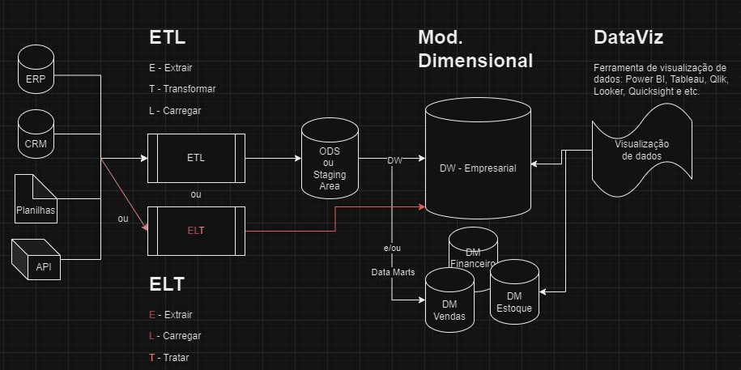

## Atividade
- [Criar uma tabela de vendas principal](#criando-uma-tabela-de-vendas);
- [Inserir dados aleatórios na tabela](#inserindo-dados-aleatórios-na-tabela);
- [Consultar os dados inseridos](#consultando-os-dados-inseridos);
- [Criar o Data Warehouse](#criando-o-data-warehouse).

## Criando uma tabela de Vendas
Antes de criarmos nossa tabela, vamos começar criando nosso banco de dados e configurando-o para uso.

Script SQL:
```sql
-- CRIANDO O BANCO DE DADOS
CREATE DATABASE "atividade_sad";

-- SELECIONANDO NOSSO BANCO
USE "atividade_sad";
```
Execução:
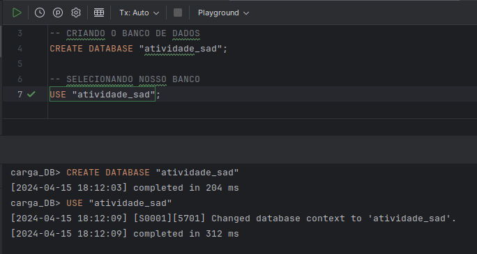

Agora vamos criar nossa tabela com o script fornecido na atividade.

Script SQL:
```sql
-- CRIANDO A TABELONA DE VENDAS
CREATE TABLE Vendas (
    VendaID INT IDENTITY(1,1) PRIMARY KEY,
    DataVenda DATETIME,
    ValorVenda DECIMAL(10, 2),
    ClienteID INT,
    NomeCliente NVARCHAR(100),
    EnderecoCliente NVARCHAR(255),
    ProdutoID INT,
    NomeProduto NVARCHAR(100),
    PrecoUnitario DECIMAL(10, 2),
    Quantidade INT,
    VendedorID INT,
    NomeVendedor NVARCHAR(100)
);
```
Execução:
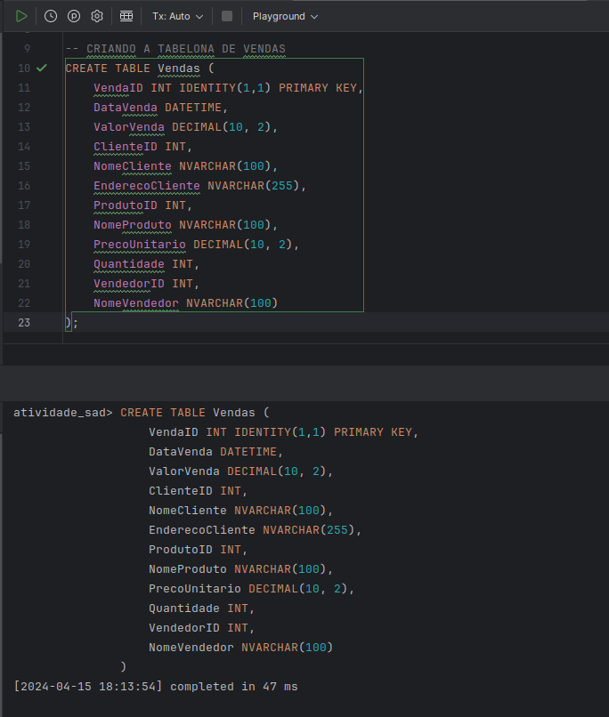

## Inserindo dados aleatórios na tabela
Com nossa tabela criada, vamos alimentá-la com dados aleatórios usando o script também fornecido na atividade.

Script SQL:
```sql
-- INSERINDO DADOS NA NOSSA TABELONA DE VENDAS
DECLARE @i INT = 0;

WHILE @i < 200
BEGIN
    INSERT INTO Vendas (
        DataVenda,
        ValorVenda,
        ClienteID,
        NomeCliente,
        EnderecoCliente,
        ProdutoID,
        NomeProduto,
        PrecoUnitario,
        Quantidade,
        VendedorID,
        NomeVendedor
    )
    VALUES (
        GETDATE(),
        ROUND((RAND() * (500 - 50) + 50), 2),
        @i % 10 + 1,
        'Cliente ' + CAST((@i % 10 + 1) AS NVARCHAR(10)),
        'Endereço ' + CAST((@i % 10 + 1) AS NVARCHAR(10)),
        @i % 5 + 1,
        'Produto ' + CAST((@i % 5 + 1) AS NVARCHAR(10)),
        ROUND((RAND() * (100 - 10) + 10), 2),
        @i % 3 + 1,
        @i % 4 + 1,
        'Vendedor ' + CAST((@i % 4 + 1) AS NVARCHAR(10))
    );

    SET @i = @i + 1;
END
```
Execução:
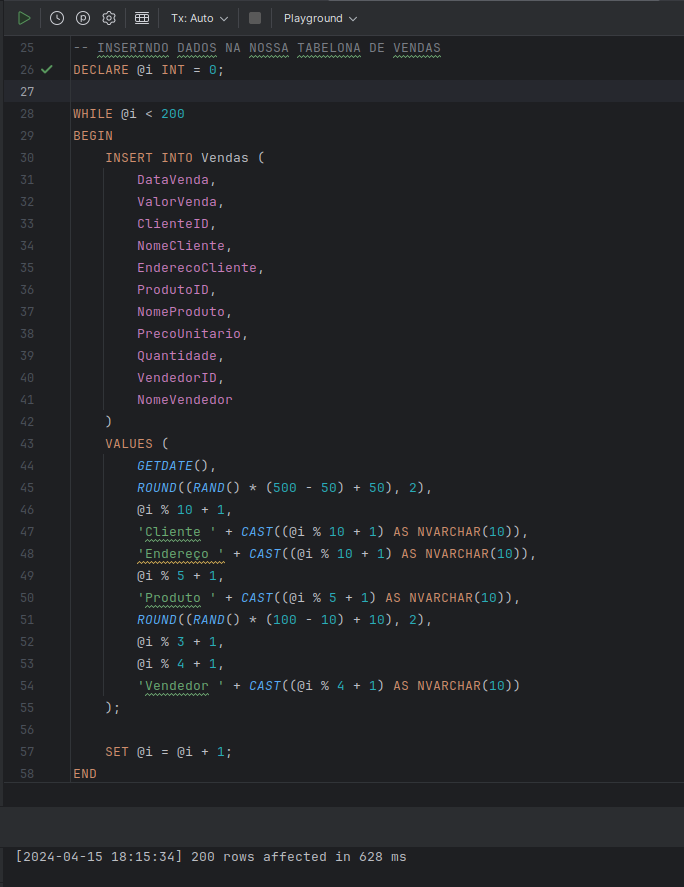

## Consultando os dados inseridos
Vamos agora selecionar os registros que foram criados.

Script SQL:
```sql
-- SELECIONANDO TODOS OS REGISTRO DA TABELONA
SELECT * FROM Vendas;
```
Execução:
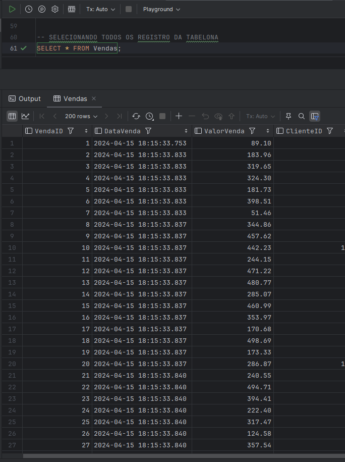

## Criando o Data Warehouse
Aqui começa o verdadeiro desafio. Precisamos analisar nossa tabela para extrair seus campos e dividi-los entre a tabela de Fato e as Dimensões.

Para ilustrar, temos o seguinte diagrama como resultado:
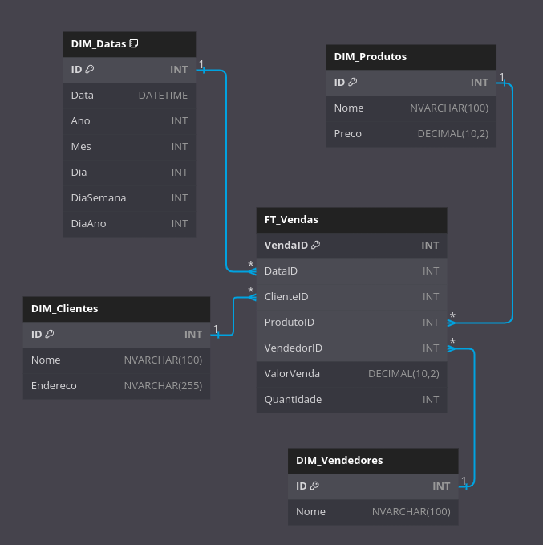

Com nossa estrutura definida, precisamos criar os scripts SQL.

### Criando a dimensão Clientes
Script SQL:
```sql
-- CRIANDO A TABELA DE DIMENSÃO - CLIENTES
CREATE TABLE DIM_Clientes (
    ID INT IDENTITY(1,1) PRIMARY KEY,
    Nome NVARCHAR(100),
    Endereco NVARCHAR(255)
);
```
Execução:
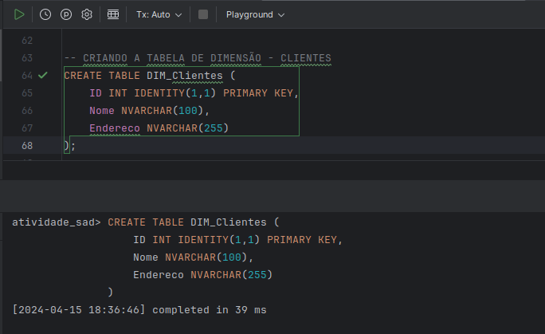

### Criando a dimensão Produtos
Script SQL:
```sql
-- CRIANDO A TABELA DE DIMENSÃO - PRODUTOS
CREATE TABLE DIM_Produtos (
    ID INT IDENTITY(1,1) PRIMARY KEY,
    Nome NVARCHAR(100),
    Preco DECIMAL(10, 2)
);
```
Execução:
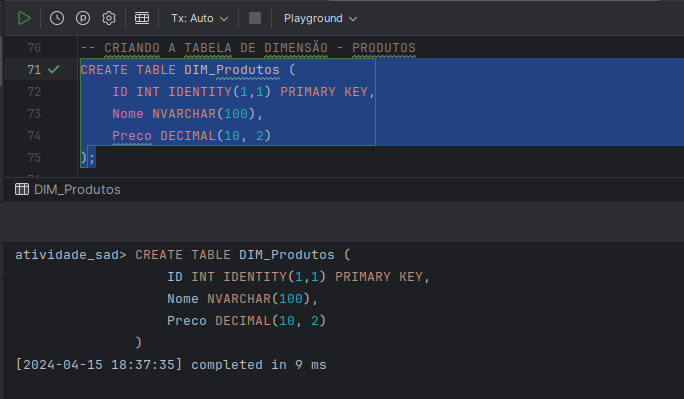

### Criando a dimensão Vendedores
Script SQL:
```sql
-- CRIANDO A TABELA DE DIMENSÃO - VENDEDORES
CREATE TABLE DIM_Vendedores (
    ID INT IDENTITY(1,1) PRIMARY KEY,
    Nome NVARCHAR(100)
);
```
Execução:
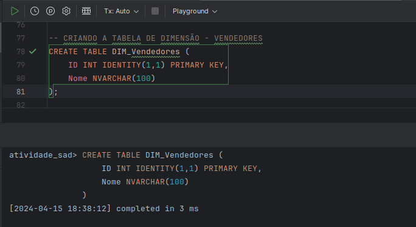

### Criando a dimensão Datas
Script SQL:
```sql
-- CRIANDO A TABELA DE DIMENSÃO - DATAS
CREATE TABLE DIM_Datas (
    ID INT IDENTITY(1,1) PRIMARY KEY,
    Data DATETIME,
    Ano INT,
    Mes INT,
    Dia INT,
    DiaSemana INT,
    DiaAno INT,
    CONSTRAINT Unique_Date UNIQUE(Data)
);
```
Execução:
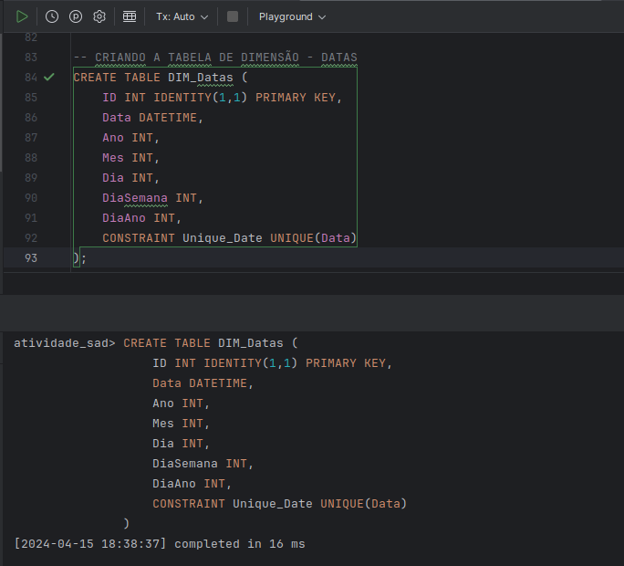

### Criando a tabela Fato
Script SQL:
```sql
-- CRIANDO A TABELA FATO
CREATE TABLE FT_Vendas (
    VendaID INT IDENTITY(1,1) PRIMARY KEY,
    DataID INT FOREIGN KEY REFERENCES DIM_Datas(ID),
    ClienteID INT FOREIGN KEY REFERENCES DIM_Clientes(ID),
    ProdutoID INT FOREIGN KEY REFERENCES DIM_Produtos(ID),
    VendedorID INT FOREIGN KEY REFERENCES DIM_Vendedores(ID),
    ValorVenda DECIMAL(10, 2),
    Quantidade INT
);
```
Execução:
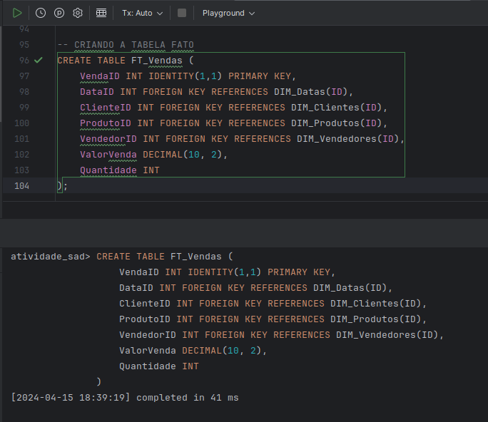

### Importando dados para a dimensão Clientes
Script SQL:
```sql
-- IMPORTANDO OS DADOS PARA TABELA DE CLIENTES
INSERT INTO DIM_Clientes (Nome, Endereco)
SELECT DISTINCT
    NomeCliente,
    EnderecoCliente
FROM Vendas;
```
Execução:
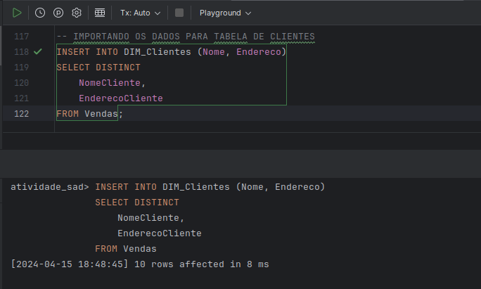

### Importando dados para a dimensão Produtos
Script SQL:
```sql
-- IMPORTANDO OS DADOS PARA TABELA DE PRODUTOS
INSERT INTO DIM_Produtos (Nome, Preco)
SELECT DISTINCT
    NomeProduto,
    PrecoUnitario
FROM Vendas;
```
Execução:
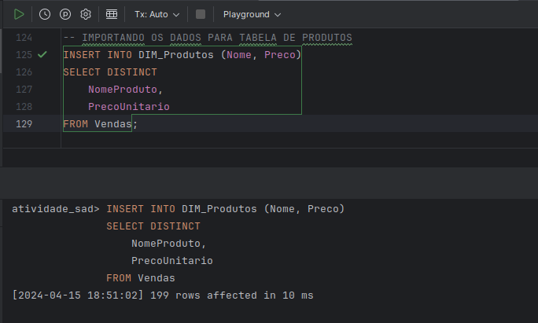

### Importando dados para a dimensão Vendedores
Script SQL:
```sql
-- IMPORTANDO OS DADOS PARA TABELA DE VENDEDORES
INSERT INTO DIM_Vendedores (Nome)
SELECT DISTINCT
    NomeVendedor
FROM Vendas;
```
Execução:
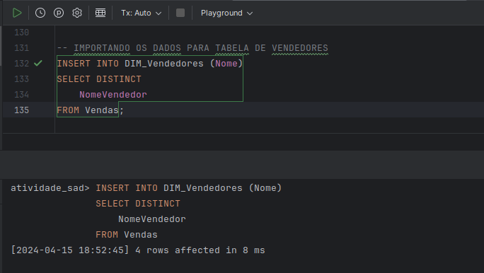

### Importando dados para a dimensão Datas
Script SQL:
```sql
-- IMPORTANDO OS DADOS PARA TABELA DE DATAS
INSERT INTO DIM_Datas (Data, Ano, Mes, Dia, DiaSemana, DiaAno)
SELECT DISTINCT
    CONVERT(DATE, DataVenda),
    YEAR(DataVenda),
    MONTH(DataVenda),
    DAY(DataVenda),
    DATEPART(WEEKDAY, DataVenda),
    DATEPART(DAYOFYEAR, DataVenda)
FROM Vendas;
```
Execução:
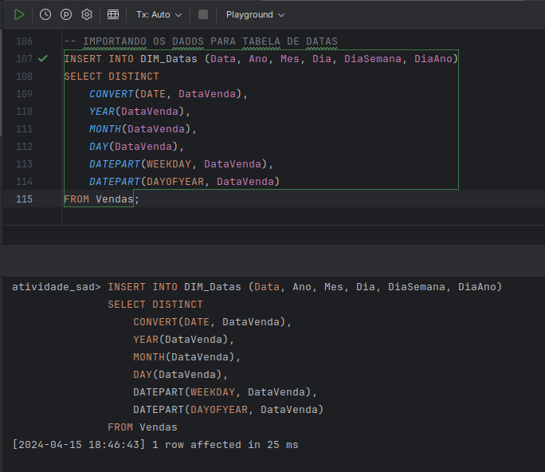

### Importando dados para a tabela Fato
Script SQL:
```sql
-- IMPORTANDO OS DADOS PARA TABELA DE VENDAS
INSERT INTO FT_Vendas (DataID, ClienteID, ProdutoID, VendedorID, ValorVenda, Quantidade)
SELECT DISTINCT
    dd.ID as DataID,
    dc.ID AS ClienteID,
    dp.ID AS ProdutoID,
    dv.ID AS VendedorID,
    v.ValorVenda,
    v.Quantidade
FROM
    Vendas v
    INNER JOIN DIM_Datas dd ON CONVERT(DATE, v.DataVenda) = dd.Data
    INNER JOIN DIM_Clientes dc ON v.NomeCliente = dc.Nome
    INNER JOIN DIM_Produtos dp ON v.NomeProduto = dp.Nome AND v.PrecoUnitario = dp.Preco
    INNER JOIN DIM_Vendedores dv ON v.NomeVendedor = dv.Nome;
```
Execução:
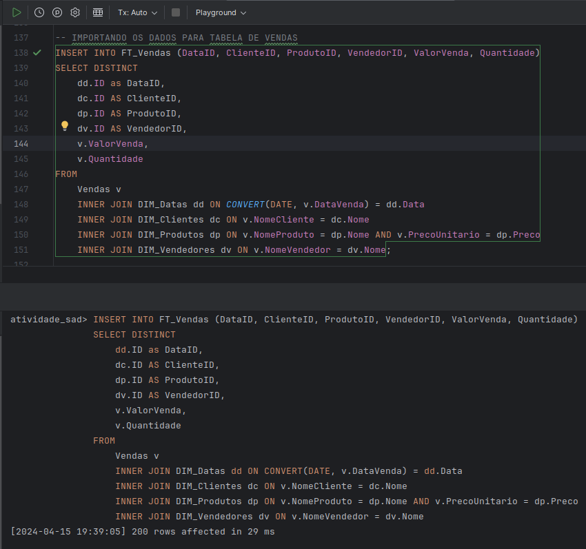

### Selecionando os registros da tabela fato
Script SQL:
```sql
-- SELECIONANDO OS REGISTROS DA TABELA FATO
SELECT * FROM FT_Vendas;
```
Execução:
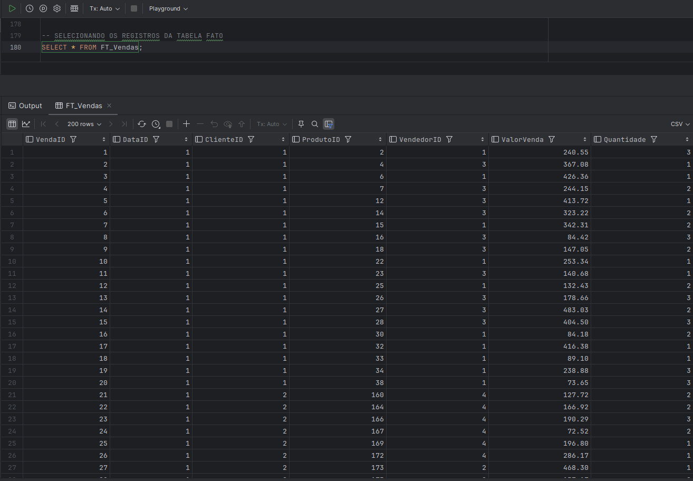

### Selecionando os registros da tabela Fato com as Dimensões
Script SQL:
```sql
-- SELECIONANDO OS REGISTROS DA TABELA FATO COM AS DIMENSÕES
SELECT
    v.VendaID,
    dd.Data,
    dc.Nome AS NomeCliente,
    dp.Nome AS NomeProduto,
    dp.Preco,
    v.Quantidade,
    dv.Nome AS NomeVendedor,
    v.ValorVenda
FROM
    FT_Vendas v
INNER JOIN
    DIM_Datas dd ON v.DataID = dd.ID
INNER JOIN
    DIM_Clientes dc ON v.ClienteID = dc.ID
INNER JOIN
    DIM_Produtos dp ON v.ProdutoID = dp.ID
INNER JOIN
    DIM_Vendedores dv ON v.VendedorID = dv.ID;
```
Execução:
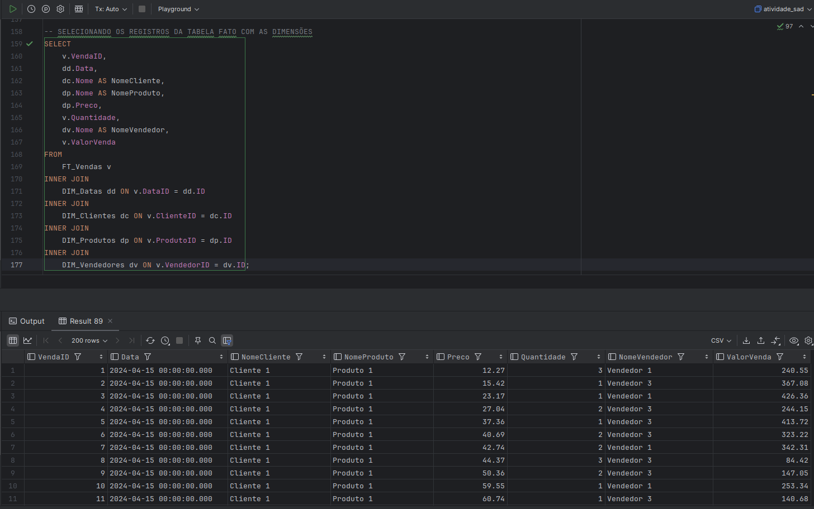

