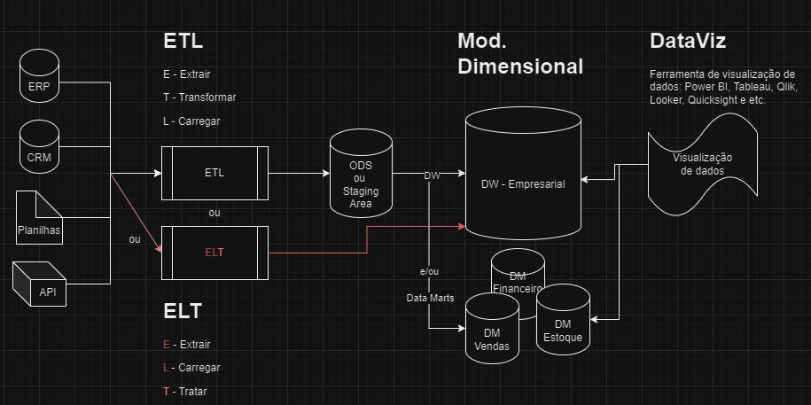

# Aplicando ETL em uma base de CRM


## Atividade
- [Criar uma base de dados para o CRM](#criar-uma-base-de-dados-para-o-crm);
- [Aplicar ETL na base](#aplicar-etl-na-base);
- [Criar o modelo dimensional (DW)](#criar-o-modelo-dimensional-dw).

## Criar uma base de dados para o CRM
Para iniciar, vamos estabelecer a estrutura inicial da base de dados com a qual estaremos trabalhando. Para adicionar um toque de criatividade, optaremos por uma abordagem inicial totalmente não padronizada. Vamos deixar de lado as regras tradicionais de normalização de dados e as melhores práticas e criar nossa tabela inicial da seguinte forma:


[Clique aqui](sql/db-crm-v1.sql) para visualizar o arquivo SQL do diagrama.

## Aplicar ETL na base
Aplicar ETL (*Extract, Transform, Load*) envolve a extração de dados de diversas fontes, sua transformação para atender aos requisitos de análise e sua carga em um destino adequado. É um processo essencial para integrar e preparar dados para análise, garantindo que estejam limpos, consistentes e prontos para uso.

### Extração (*Extract*)
Identificar as tabelas relevantes para o processo de ETL. Neste caso, as tabelas envolvidas são:

- CustomerData (Tabela de Clientes)
- ProdInfos (Tabela de Produtos)
- CatTabela (Tabela de Categorias de Produto)
- EmployeePessoas (Tabela de Funcionários)
- OrdensTrans (Tabela de Pedidos)
- PedidoItens (Tabela de Itens do Pedido)
- InteracLogs (Tabela de Interações)

### Transformação (*Transform*)
Aplicar as transformações necessárias nos dados para adequá-los ao modelo da camada ODS. Algumas transformações possíveis são:

#### Reestruturação e o remapeamento dos dados
Criação de novas tabelas, divisão de tabelas existentes, junção de múltiplas tabelas, normalização de dados.

##### CustomerData → Clientes
| Antes | Atributos | Depois | Atributos
| - | - | - | - |
| idCliente | INT PRIMARY KEY | ClienteID | INT IDENTITY(1,1) PRIMARY KEY
| nomeComp | VARCHAR(100) NOT NULL | Nome | VARCHAR(50) NOT NULL
| nomeComp | VARCHAR(100) NOT NULL | Sobrenome | VARCHAR(50) NOT NULL
| email | VARCHAR(100) NOT NULL | Email | VARCHAR(100) NOT NULL
| telefone | VARCHAR(20) NULL | Telefone | VARCHAR(20) NULL
| endRua | VARCHAR(200) NULL | Endereco | VARCHAR(200) NULL
| endCid | VARCHAR(50) NULL | Cidade | VARCHAR(50) NULL
| endEst | CHAR(2) NULL | Estado | CHAR(2) NULL
| endCEP | CHAR(8) NULL | CEP | CHAR(8) NULL

##### ProdInfos → Produtos
| Antes | Atributos | Depois | Atributos
| - | - | - | - |
| prodID | INT PRIMARY KEY | ProdutoID | INT IDENTITY(1,1) PRIMARY KEY
| prodNome | VARCHAR(100) NOT NULL | Nome | VARCHAR(100) NOT NULL
| prodDesc | VARCHAR(MAX) NULL | Descricao | VARCHAR(MAX) NULL
| prodPreco | DECIMAL(10,2) NOT NULL | Preco | DECIMAL(10,2) NOT NULL
| categoriaID | INT NOT NULL | - | -

##### CatTabela → Categorias
| Antes | Atributos | Depois | Atributos
| - | - | - | - |
| catID | INT PRIMARY KEY | CategoriaID | INT IDENTITY(1,1) PRIMARY KEY
| catNome | VARCHAR(50) NOT NULL | Nome | VARCHAR(50) NOT NULL

##### EmployeePessoas → Funcionarios
| Antes | Atributos | Depois | Atributos
| - | - | - | - |
| funcID | INT PRIMARY KEY | FuncionarioID | INT IDENTITY(1,1) PRIMARY KEY
| firstName | VARCHAR(50) NOT NULL | Nome | VARCHAR(50) NOT NULL
| lastName | VARCHAR(50) NOT NULL | Sobrenome | VARCHAR(50) NOT NULL
| email | VARCHAR(100) NOT NULL | Email | VARCHAR(100) NOT NULL
| tel | VARCHAR(20) NULL | Telefone | VARCHAR(20) NULL
| cargo | VARCHAR(50) NOT NULL | Cargo | VARCHAR(50) NOT NULL

##### OrdensTrans → Pedidos
| Antes | Atributos | Depois | Atributos
| - | - | - | - |
| ordensID | INT PRIMARY KEY | PedidoID | INT IDENTITY(1,1) PRIMARY KEY
| clienteID | INT NOT NULL | ClienteID | INT FOREIGN KEY REFERENCES Clientes(ClienteID)
| dataOrdens | DATETIME NOT NULL | DataPedido | DATETIME NOT NULL
| statusPedido | VARCHAR(20) NOT NULL | StatusPedido | VARCHAR(20) NOT NULL

##### PedidoItens → ItensPedido
| Antes | Atributos | Depois | Atributos
| - | - | - | - |
| itemID | INT PRIMARY KEY | ItemPedidoID | INT IDENTITY(1,1) PRIMARY KEY
| pedidoID | INT NOT NULL | PedidoID | INT FOREIGN KEY REFERENCES Pedidos(PedidoID)
| prodID | INT NOT NULL | ProdutoID | INT FOREIGN KEY REFERENCES Produtos(ProdutoID)
| qtd | INT NOT NULL | Quantidade | INT NOT NULL
| precoUnit | DECIMAL(10,2) NOT NULL | PrecoUnitario | DECIMAL(10,2) NOT NULL

##### InteracLogs → Interacoes
| Antes | Atributos | Depois | Atributos
| - | - | - | - |
| logID | INT PRIMARY KEY | InteracaoID | INT IDENTITY(1,1) PRIMARY KEY
| clienteID | INT NOT NULL | ClienteID | INT FOREIGN KEY REFERENCES Clientes(ClienteID)
| funcID | INT NOT NULL | FuncionarioID | INT FOREIGN KEY REFERENCES Funcionarios(FuncionarioID)
| dataInter | DATETIME NOT NULL | Data | DATETIME NOT NULL
| tipo | VARCHAR(20) NOT NULL | Tipo | VARCHAR(20) NOT NULL
| anot | VARCHAR(MAX) NULL | Anotacoes | VARCHAR(MAX) NULL

##### → ProdutoCategoria (nova)
Essa tabela foi projetada para permitir que um produto seja categorizado em uma ou várias categorias. Ela utilizará o campo categoriaID da tabela ProdInfos para manter a consistência com os dados existentes e terá uma chave primária composta.

| Antes | Atributos | Depois | Atributos
| - | - | - | - |
| - | - | ProdutoID | INT NOT NULL FOREIGN KEY REFERENCES Produtos(ProdutoID)
| - | - | CategoriaID | INT NOT NULL FOREIGN KEY REFERENCES Categorias(CategoriaID)

### Carga (*Load*)
Carregar os dados transformados na camada ODS, seguindo o modelo de dados projetado para essa camada.

#### Criando o banco de dados ODS
Vamos criar nosso banco de dados ODS:
```sql
CREATE DATABASE ODS_CRM;
```
#### Criando as tabelas no ODS
1. Tabela de Clientes
```sql
CREATE TABLE ODS_Clientes (
    ClienteID INT IDENTITY(1,1) PRIMARY KEY,
    Nome VARCHAR(50) NOT NULL,
    Sobrenome VARCHAR(50) NOT NULL,
    Email VARCHAR(100) NOT NULL,
    Telefone VARCHAR(20) NULL,
    Endereco VARCHAR(200) NULL,
    Cidade VARCHAR(50) NULL,
    Estado CHAR(2) NULL,
    CEP CHAR(8) NULL
);
```
2. Tabela de Pedidos
```sql
CREATE TABLE ODS_Pedidos (
    PedidoID INT IDENTITY(1,1) PRIMARY KEY,
    ClienteID INT NOT NULL FOREIGN KEY REFERENCES Clientes(ClienteID),
    DataPedido DATETIME NOT NULL,
    StatusPedido VARCHAR(20) NOT NULL
);
```
3. Tabela de Itens do Pedido
```sql
CREATE TABLE ODS_ItensPedido (
    ItemPedidoID INT IDENTITY(1,1) PRIMARY KEY,
    PedidoID INT NOT NULL FOREIGN KEY REFERENCES Pedidos(PedidoID),
    ProdutoID INT NOT NULL FOREIGN KEY REFERENCES Produtos(ProdutoID),
    Quantidade INT NOT NULL,
    PrecoUnitario DECIMAL(10,2) NOT NULL
);
```
4. Tabela de Produtos
```sql
CREATE TABLE ODS_Produtos (
    ProdutoID INT IDENTITY(1,1) PRIMARY KEY,
    Nome VARCHAR(100) NOT NULL,
    Descricao VARCHAR(MAX) NULL,
    Preco DECIMAL(10,2) NOT NULL
);
```
5. Tabela de Categorias
```sql
CREATE TABLE ODS_Categorias (
    CategoriaID INT IDENTITY(1,1) PRIMARY KEY,
    Nome VARCHAR(50) NOT NULL
);
```
6. Tabela de Categorias do Produto
```sql
CREATE TABLE ODS_ProdutoCategoria (
    ProdutoID INT NOT NULL FOREIGN KEY REFERENCES Produtos(ProdutoID),
    CategoriaID INT NOT NULL FOREIGN KEY REFERENCES Categorias(CategoriaID),
    PRIMARY KEY (ProdutoID, CategoriaID)
);
```
7. Tabela de Funcionários
```sql
CREATE TABLE ODS_Funcionarios (
    FuncionarioID INT IDENTITY(1,1) PRIMARY KEY,
    Nome VARCHAR(50) NOT NULL,
    Sobrenome VARCHAR(50) NOT NULL,
    Email VARCHAR(100) NOT NULL,
    Telefone VARCHAR(20) NULL,
    Cargo VARCHAR(50) NOT NULL
);
```
8. Tabela de Interações
```sql
CREATE TABLE ODS_Interacoes (
    InteracaoID INT IDENTITY(1,1) PRIMARY KEY,
    ClienteID INT NOT NULL FOREIGN KEY REFERENCES Clientes(ClienteID),
    FuncionarioID INT NOT NULL FOREIGN KEY REFERENCES Funcionarios(FuncionarioID),
    Data DATETIME NOT NULL,
    Tipo VARCHAR(20) NOT NULL,
    Anotacoes VARCHAR(MAX) NULL
);
```

#### Ao final, teremos a seguinte estrutura:


[Clique aqui](sql/db-crm-v2.sql) para visualizar o arquivo SQL do diagrama.

## Criar o modelo dimensional (DW)
Criar um modelo dimensional (*Data Warehouse*) implica na concepção de uma estrutura de dados otimizada para análise de negócios. Esse modelo é composto por tabelas de fatos que representam métricas de negócios e tabelas de dimensão que fornecem contexto para essas métricas. O objetivo é facilitar consultas analíticas eficientes e oferecer uma visão consistente e integrada dos dados da organização.

### Identificando as tabelas de dimensão e de fato.

| Antes | Depois | Tipo
| - | - | - |
| ODS_Clientes | DimensaoCliente | Dimensão
| ODS_Pedidos e ODS_ItensPedido  | FatoPedido | Fato
| ODS_Produtos | DimensaoProduto | Dimensão
| ODS_Categorias | DimensaoCategoria | Dimensão
| ODS_ProdutoCategoria | - | -
| ODS_Funcionarios | DimensaoFuncionario | Dimensão
| ODS_Interacoes | DimensaoInteracao | Dimensão
| - | DimensaoTempo | Dimensão

### Criando a nova estrutura
1. Dimensão de Cliente
```sql
CREATE TABLE DimensaoCliente (
    ClienteID INT PRIMARY KEY,
    Nome VARCHAR(50) NOT NULL,
    Sobrenome VARCHAR(50) NOT NULL,
    Email VARCHAR(100) NOT NULL,
    Telefone VARCHAR(20) NULL,
    Endereco VARCHAR(200) NULL,
    Cidade VARCHAR(50) NULL,
    Estado CHAR(2) NULL,
    CEP CHAR(8) NULL
);
```
2. Dimensão de Produto
```sql
CREATE TABLE DimensaoProduto (
    ProdutoID INT PRIMARY KEY,
    Nome VARCHAR(100) NOT NULL,
    Descricao VARCHAR(MAX) NULL,
    CategoriaID INT FOREIGN KEY REFERENCES DimensaoCategoria(CategoriaID)
);
```
3. Dimensão de Categoria
```sql
CREATE TABLE DimensaoCategoria (
    CategoriaID INT PRIMARY KEY,
    Nome VARCHAR(50) NOT NULL
);
```
4. Dimensão de Funcionário
```sql
CREATE TABLE DimensaoFuncionario (
    FuncionarioID INT PRIMARY KEY,
    Nome VARCHAR(50) NOT NULL,
    Sobrenome VARCHAR(50) NOT NULL,
    Email VARCHAR(100) NOT NULL,
    Telefone VARCHAR(20) NULL,
    Cargo VARCHAR(50) NOT NULL
);
```
5. Dimensão de Tempo (Datas)
```sql
CREATE TABLE DimensaoTempo (
    DataID INT PRIMARY KEY,
    Data DATE NOT NULL,
    Ano INT NOT NULL,
    Mes INT NOT NULL,
    Semana INT NOT NULL
);
```
6. Dimensão de Interação
```sql
CREATE TABLE DimensaoInteracao (
    InteracaoID INT PRIMARY KEY,
    Tipo VARCHAR(20) NOT NULL
);
```
7. Fato de Pedido
```sql
CREATE TABLE FatoPedido (
    PedidoID INT PRIMARY KEY,
    ClienteID INT FOREIGN KEY REFERENCES DimensaoCliente(ClienteID),
    FuncionarioID INT FOREIGN KEY REFERENCES DimensaoFuncionario(FuncionarioID),
    DataID INT FOREIGN KEY REFERENCES DimensaoTempo(DataID),
    InteracaoID INT FOREIGN KEY REFERENCES DimensaoInteracao(InteracaoID),
    StatusPedido VARCHAR(20) NOT NULL,
    ProdutoID INT FOREIGN KEY REFERENCES DimensaoProduto(ProdutoID),
    Quantidade INT NOT NULL,
    PrecoUnitario DECIMAL(10,2) NOT NULL
);
```
### Resultado final


[Clique aqui](sql/db-crm-v3.sql) para visualizar o arquivo SQL do diagrama.