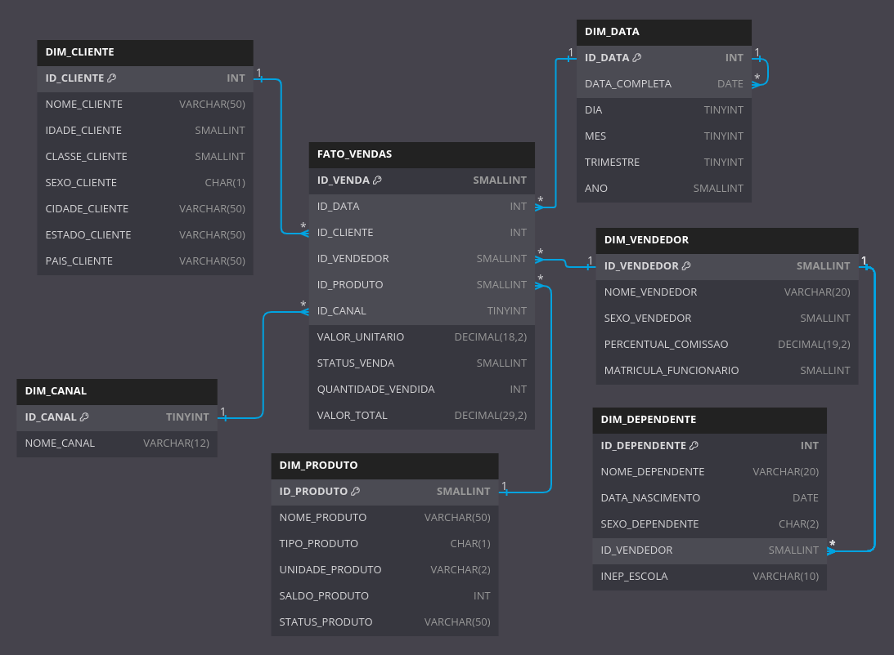

# Atividade de ETL/ODS/DW


## Atividade
- [Importar o banco de dados fornecido](#importar-o-banco-de-dados-fornecido);
- [Aplicar ETL na base](#aplicar-etl-na-base);
- [Criar o modelo dimensional (DW)](#criar-o-modelo-dimensional-dw).

## Importar o banco de dados fornecido
Aqui não há muito segredo, vamos importar o arquivo .bak pelo SQL Server Management Studio (SSMS). Você pode seguir estes passos:

1. Abra o SQL Server Management Studio e conecte-se ao seu servidor SQL Server;
2. No Explorador de Objetos, clique com o botão direito do mouse em "Bancos de Dados";
3. Selecione "Restaurar Banco de Dados";
4. Na janela "Restaurar Banco de Dados", escolha "Dispositivo" como a fonte do backup;
5. Clique no botão "..." ao lado do campo "Dispositivo" para abrir a janela "Selecionar Dispositivos de Backup";
6. Adicione o arquivo [bd_erp.bak](sql/bd_erp.bak) que deseja importar, navegando até o local desejado;
7. Selecione o arquivo e clique em "OK".

Após esses passos, o banco de dados deverá estar restaurado e disponível com a seguinte estrutura:


## Aplicar ETL na base
Aplicar ETL (*Extract, Transform, Load*) envolve a extração de dados de diversas fontes, sua transformação para atender aos requisitos de análise e sua carga em um destino adequado. É um processo essencial para integrar e preparar dados para análise, garantindo que estejam limpos, consistentes e prontos para uso.

### Extração (*Extract*)
Identificar as tabelas relevantes para o processo de ETL. Neste caso, as tabelas envolvidas são:

- tbvdd (Tabela de Vendedores)
- tbdep (Tabela de Dependentes)
- tbpro (Tabela de Produtos)
- tbven (Tabela de Vendas)
- tbven_item (Tabela de Itens de Venda)

### Transformação (*Transform*)
Aplicar as transformações necessárias nos dados para adequá-los ao modelo da camada ODS. Algumas transformações possíveis são:

#### Reestruturação e o remapeamento dos dados
Criação de novas tabelas, divisão de tabelas existentes, junção de múltiplas tabelas, normalização de dados.

- tbven
    - cdven
    - dtven
    - cdcli
    - canal
    - stven
    - deleted
    - cdvdd
- tbven_item
    - cdvenitem
    - cdven
    - cdpro
    - qtven
    - vruven
    - vrtven
- tbpro
    - cdpro
    - nmpro
    - tppro
    - undpro
    - slpro
    - stpro
- tbvdd
    - cdvdd
    - nmvdd
    - sxvdd
    - perccomissao
    - matfunc
- tbdep
    - tbdep
    - nmdep
    - dtnasc
    - sxdep
    - cdvdd
    - inepescola
- Clientes (nova)
    - cdcli
    - nnmcli
    - agecli
    - clacli
    - sxcli
    - cidcli
    - estcli
    - paicli

#### Renomeação de colunas
Alterar os nomes das colunas para se adequarem aos padrões ou convenções do modelo de destino.

- tbven -> ODS_VENDAS
    - cdven -> ID_VENDA
    - dtven -> DATA_VENDA
    - cdcli -> ID_CLIENTE
    - canal -> CANAL_VENDA
    - stven -> STATUS_VENDA
    - deleted -> EXCLUIDA
    - cdvdd -> ID_VENDEDOR
- tbven_item -> ODS_ITENS_VENDA
    - cdvenitem -> ID_ITEM_VENDA
    - cdven -> ID_VENDA
    - cdpro -> ID_PRODUTO
    - qtven -> QUANTIDADE_VENDIDA
    - vruven -> VALOR_UNITARIO
    - vrtven -> VALOR_TOTAL
- tbpro -> ODS_PRODUTOS
    - cdpro -> ID_PRODUTO
    - nmpro -> NOME_PRODUTO
    - tppro -> TIPO_PRODUTO
    - undpro -> UNIDADE_PRODUTO
    - slpro -> SALDO_PRODUTO
    - stpro -> STATUS_PRODUTO
- tbvdd -> ODS_VENDEDORES
    - cdvdd -> ID_VENDEDOR
    - nmvdd -> NOME_VENDEDOR
    - sxvdd -> SEXO_VENDEDOR
    - perccomissao -> PERCENTUAL_COMISSAO
    - matfunc -> MATRICULA_FUNCIONARIO
- tbdep -> ODS_DEPENDENTES
    - tbdep -> ID_DEPENDENTE
    - nmdep -> NOME_DEPENDENTE
    - dtnasc -> DATA_NASCIMENTO
    - sxdep -> SEXO_DEPENDENTE
    - cdvdd -> ID_VENDEDOR
    - inepescola -> INEP_ESCOLA
- Clientes (nova)
    - cdcli -> ID_CLIENTE
    - nnmcli -> NOME_CLIENTE
    - agecli -> IDADE_CLIENTE
    - clacli -> CLASSE_CLIENTE
    - sxcli -> SEXO_CLIENTE
    - cidcli -> CIDADE_CLIENTE
    - estcli -> ESTADO_CLIENTE
    - paicli -> PAIS_CLIENTE


#### Conversão de tipos de dados
Vamos padronizar para que todos os campos relacionados ao sexo recebam valores booleanos, onde 1 representa masculino e 0 representa feminino.

SQL da tabela ODS_CLIENTES:
```sql
CREATE TABLE ODS_CLIENTES (
    ...
    SEXO_CLIENTE BIT,
    ...
);
```
SQL da tabela ODS_VENDEDORES:
```sql
CREATE TABLE ODS_VENDEDORES (
    ...
    SEXO_VENDEDOR BIT,
    ...
);
```
SQL da tabela ODS_DEPENDENTES:
```sql
CREATE TABLE ODS_DEPENDENTES (
    ...
    SEXO_DEPENDENTE BIT,
    ...
);
```

#### Limpeza e padronização de dados
Vamos remover os espaços no começo e no final de alguns campos que apresentam esse problema.


```sql
SELECT
    cdvdd,
    LTRIM(RTRIM(nmvdd)) AS nmvdd,
    sxvdd
FROM dbo.tbvdd;
```


#### Filtragem de dados
Vamos aplicar alguns filtros para evitar dados inconsistentes ou desnecessários.

1. Vamos manter apenas Vendas que não foram excluídas
```sql
SELECT * FROM dbo.tbven WHERE deleted = 0;
```
2. Vamos dar um nome genérico quando o vendedor não tiver o nome preenchido, pois ele ainda poderá ser identificado pelo seu código de vendedor.
```sql
SELECT 
       ...
       LTRIM(RTRIM(ISNULL(nmcli, 'Desconhecido'))) AS nmcli,
       cdvdd
       ...
FROM tbven;
```

### Carga (*Load*)
Carregar os dados transformados na camada ODS, seguindo o modelo de dados projetado para essa camada.

#### Criando o banco de dados ODS
Vamos criar nosso banco de dados ODS:
```sql
CREATE DATABASE ODS_ERP;
```
#### Criando as tabelas no ODS
1. Tabela de Clientes
```sql
CREATE TABLE ODS_CLIENTES (
    ID_CLIENTE INT PRIMARY KEY,
    NOME_CLIENTE VARCHAR(50),
    IDADE_CLIENTE SMALLINT,
    CLASSE_CLIENTE SMALLINT,
    SEXO_CLIENTE BIT,
    CIDADE_CLIENTE VARCHAR(50),
    ESTADO_CLIENTE VARCHAR(50),
    PAIS_CLIENTE VARCHAR(50)
);
```
2. Tabela de Vendedores
```sql
CREATE TABLE ODS_VENDEDORES (
    ID_VENDEDOR SMALLINT PRIMARY KEY,
    NOME_VENDEDOR VARCHAR(20),
    SEXO_VENDEDOR BIT,
    PERCENTUAL_COMISSAO DECIMAL(19,2),
    MATRICULA_FUNCIONARIO SMALLINT
);
```
3. Tabela de Produtos
```sql
CREATE TABLE ODS_PRODUTOS (
    ID_PRODUTO SMALLINT PRIMARY KEY,
    NOME_PRODUTO VARCHAR(50),
    TIPO_PRODUTO CHAR(1),
    UNIDADE_PRODUTO VARCHAR(2),
    SALDO_PRODUTO INT,
    STATUS_PRODUTO VARCHAR(50)
);
```
4. Tabela de Vendas
```sql
CREATE TABLE ODS_VENDAS (
    ID_VENDA SMALLINT PRIMARY KEY,
    DATA_VENDA DATE,
    ID_CLIENTE INT,
    CANAL_VENDA VARCHAR(12),
    STATUS_VENDA SMALLINT,
    EXCLUIDA SMALLINT,
    ID_VENDEDOR SMALLINT,
    FOREIGN KEY (ID_CLIENTE) REFERENCES ODS_CLIENTES(ID_CLIENTE),
    FOREIGN KEY (ID_VENDEDOR) REFERENCES ODS_VENDEDORES(ID_VENDEDOR)
);
```
5. Tabela de Itens da Venda
```sql
CREATE TABLE ODS_ITENS_VENDA (
    ID_ITEM_VENDA SMALLINT PRIMARY KEY,
    ID_VENDA SMALLINT,
    ID_PRODUTO SMALLINT,
    QUANTIDADE_VENDIDA INT,
    VALOR_UNITARIO DECIMAL(18,2),
    VALOR_TOTAL DECIMAL(29,2),
    FOREIGN KEY (ID_VENDA) REFERENCES ODS_VENDAS(ID_VENDA),
    FOREIGN KEY (ID_PRODUTO) REFERENCES ODS_PRODUTOS(ID_PRODUTO)
);
```
6. Tabela de Dependentes
```sql
CREATE TABLE ODS_DEPENDENTES (
    ID_DEPENDENTE INT PRIMARY KEY IDENTITY,
    NOME_DEPENDENTE VARCHAR(20),
    DATA_NASCIMENTO DATE,
    SEXO_DEPENDENTE BIT,
    ID_VENDEDOR SMALLINT,
    INEP_ESCOLA VARCHAR(10),
    FOREIGN KEY (ID_VENDEDOR) REFERENCES ODS_VENDEDORES(ID_VENDEDOR)
);
```
#### Ao final, teremos a seguinte estrutura:


## Criar o modelo dimensional (DW)
Criar um modelo dimensional (*Data Warehouse*) implica na concepção de uma estrutura de dados otimizada para análise de negócios. Esse modelo é composto por tabelas de fatos que representam métricas de negócios e tabelas de dimensão que fornecem contexto para essas métricas. O objetivo é facilitar consultas analíticas eficientes e oferecer uma visão consistente e integrada dos dados da organização.

### Identificando as tabelas de dimensão e de fato.
- DIMENSÕES
    - ODS_CLIENTES
    - ODS_VENDEDORES
    - ODS_PRODUTOS
    - ODS_DEPENDENTES
    - DATA (a ser criada)
    - CANAL (a ser criada a partir do campo CANAL_VENDAS em ODS_VENDAS)
- FATO
    - ODS_VENDAS // ODS_ITENS_VENDA

### Criando a nova estrutura 
1. Dimensão de Cliente
```sql
CREATE TABLE DIM_CLIENTE (
    ID_CLIENTE INT PRIMARY KEY,
    NOME_CLIENTE VARCHAR(50),
    IDADE_CLIENTE SMALLINT,
    CLASSE_CLIENTE SMALLINT,
    SEXO_CLIENTE BIT,
    CIDADE_CLIENTE VARCHAR(50),
    ESTADO_CLIENTE VARCHAR(50),
    PAIS_CLIENTE VARCHAR(50)
);
```
2. Dimensão de Vendedor
```sql
CREATE TABLE DIM_VENDEDOR (
    ID_VENDEDOR SMALLINT PRIMARY KEY,
    NOME_VENDEDOR VARCHAR(20),
    SEXO_VENDEDOR BIT,
    PERCENTUAL_COMISSAO DECIMAL(19,2),
    MATRICULA_FUNCIONARIO SMALLINT
);
```
3. Dimensão de Produto
```sql
CREATE TABLE DIM_PRODUTO (
    ID_PRODUTO SMALLINT PRIMARY KEY,
    NOME_PRODUTO VARCHAR(50),
    TIPO_PRODUTO CHAR(1),
    UNIDADE_PRODUTO VARCHAR(2),
    SALDO_PRODUTO INT,
    STATUS_PRODUTO VARCHAR(50)
);
```
4. Dimensão de Dependente
```sql
CREATE TABLE DIM_DEPENDENTE (
    ID_DEPENDENTE INT PRIMARY KEY,
    NOME_DEPENDENTE VARCHAR(20),
    DATA_NASCIMENTO DATE,
    SEXO_DEPENDENTE BIT,
    ID_VENDEDOR SMALLINT FOREIGN KEY REFERENCES DIM_VENDEDOR(ID_VENDEDOR),
    INEP_ESCOLA VARCHAR(10)
);
```
5. Dimensão de Data
```sql
CREATE TABLE DIM_DATA (
    ID_DATA INT PRIMARY KEY,
    DATA_COMPLETA DATE,
    DIA TINYINT,
    MES TINYINT,
    TRIMESTRE TINYINT,
    ANO SMALLINT
);
```
6. Dimensão de Canal
```sql
CREATE TABLE DIM_CANAL (
    ID_CANAL TINYINT PRIMARY KEY,
    NOME_CANAL VARCHAR(12)
);
```
7. Fato de Vendas
```sql
CREATE TABLE FATO_VENDAS (
    ID_VENDA SMALLINT PRIMARY KEY,
    ID_DATA INT FOREIGN KEY REFERENCES DIM_DATA(ID_DATA),
    ID_CLIENTE INT FOREIGN KEY REFERENCES DIM_CLIENTE(ID_CLIENTE),
    ID_VENDEDOR SMALLINT FOREIGN KEY REFERENCES DIM_VENDEDOR(ID_VENDEDOR),
    ID_PRODUTO SMALLINT FOREIGN KEY REFERENCES DIM_PRODUTO(ID_PRODUTO),
    ID_CANAL TINYINT FOREIGN KEY REFERENCES DIM_CANAL(ID_CANAL),
    VALOR_UNITARIO DECIMAL(18,2),
    STATUS_VENDA SMALLINT,
    QUANTIDADE_VENDIDA INT,
    VALOR_TOTAL DECIMAL(29,2)
);
```
### Resultado final
